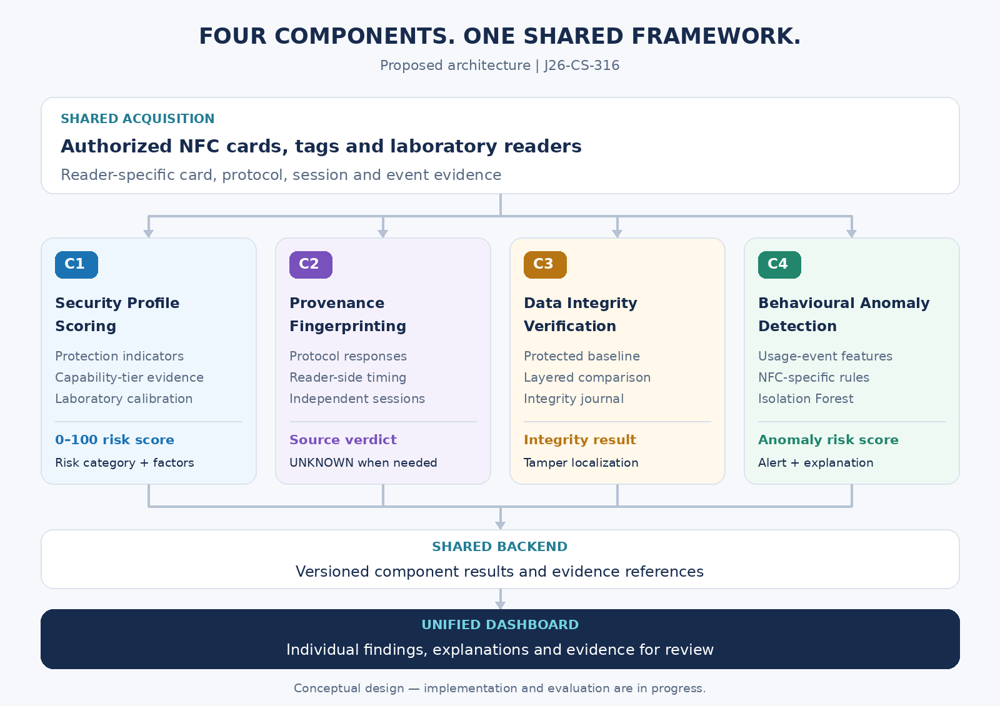

<div align="center">


# NFC Card and Tag Security Enhancement Framework
### Using Hybrid Detection

**Final Year Research Project · Sri Lanka Institute of Information Technology**


<br>

[Overview](#project-overview) · [Components](#four-research-components) · [Architecture](#proposed-architecture) · [Team](#research-team) · [Progress](#project-progress) · [Proposals](#proposal-reports)

</div>

---

## Project Overview

**One framework. Four complementary views of NFC security.**

This project investigates how NFC cards and tags can be assessed through **security exposure, source behaviour, data integrity, and usage patterns**. Each component addresses an independent research question, while shared acquisition and agreed data formats support a unified review interface.

The planned framework helps a reviewer understand:

- **How exposed is the card?** — C1 assesses protection settings and attacker capabilities.
- **Does its source behaviour look unusual?** — C2 examines protocol-response evidence across sessions.
- **What has changed?** — C3 compares current contents with a protected enrolled baseline.
- **Is its usage suspicious?** — C4 combines behavioural rules with anomaly detection.

> **Development status:** This repository is at the initial development stage. Features, architecture, and outputs described below are proposed work. Detection accuracy and operational readiness have not yet been established.

## Four Research Components

| | Component | Research approach | Planned output |
|:---:|---|---|---|
| **C1** | **NFC Security Profile Scoring Model** | Capability-aware profiling, laboratory outcomes, and time-to-compromise calibration | **0–100 security risk score**, risk category, and contributing factors |
| **C2** | **Multi-Session Protocol-Response Provenance Fingerprinting** | Protocol-response and reader-side timing features; Random Forest, SVM, and k-NN comparison; UNKNOWN rejection | **Original-like / Clone-like / Emulator-like / UNKNOWN**, with supporting evidence |
| **C3** | **NFC Tag Data Integrity Verification** | HMAC-protected enrollment baseline; application/NDEF, raw-memory, and supported security-state checks; integrity journal | **Integrity result**, changed fields or memory regions, and tamper localization |
| **C4** | **NFC Hybrid Behavioural Anomaly Detection** | NFC-specific rules combined with Isolation Forest on usage-event features | **Anomaly risk score**, alert level, and explanation |

**Interpreting the findings:** The components measure different properties. C1 and C4 scores are separate assessments; a C2 verdict or C4 alert alone does not establish malicious activity. Unavailable or unsupported evidence must remain explicit.

## Proposed Architecture

<p align="center">
  
</p>

**Integration principle:** Each component retains its own processing and evaluation methods. Shared schemas define inputs and versioned result records. The backend stores findings and evidence references; the dashboard presents them for review.

## Research Team

| Member | Student ID | Responsibility | Working branch |
|---|---|---|:---:|
| **Anjana I.K.D.** | IT23160620 | C1 — Security Profile Scoring | `c1` |
| **Anulasha K.A.** | IT23139480 | C2 — Provenance Fingerprinting | `c2` |
| **Abeykoon A.M.A.S.K.** | IT23403642 | C3 — Data Integrity Verification | `c3` |
| **Perera L.M.D.** | IT23404182 | C4 — Behavioural Anomaly Detection | `c4` |

The team coordinates shared reader acquisition, data definitions, backend services, dashboard development, and integration testing.

## Project Progress

| Milestone | Current position |
|---|---|
| Research scope and component proposals | Four reports available below |
| GitHub repository | Created |
| Shared folder structure and component branches | Being established |
| C2 preliminary Flipper Zero feasibility experiments | Planned |
| Proxmark3 RDV2 | Awaiting delivery |
| Component implementation and experimental evaluation | Upcoming |
| Shared backend and unified dashboard | Planned |

*Update this table as milestones are completed. Link experimental evidence and reviewable changes when available.*

## Proposal Reports

| Component | Report |
|:---:|---|
| **C1** | [Security Profile Scoring — IT23160620](docs/proposals/C1_IT23160620.pdf) |
| **C2** | [Provenance Fingerprinting — IT23139480](docs/proposals/C2_IT23139480.pdf) |
| **C3** | [Data Integrity Verification — IT23403642](docs/proposals/C3_IT23403642.pdf) |
| **C4** | [Behavioural Anomaly Detection — IT23404182](docs/proposals/C4_IT23404182.pdf) |

## Repository Guide

The table describes the planned implementation structure. Component folders will be populated as development proceeds.

| Location | Purpose |
|---|---|
| `components/c1_security_scoring/` | Card profiling, calibration, and security risk scoring |
| `components/c2_provenance/` | Session collection, features, data splits, models, and UNKNOWN rejection |
| `components/c3_integrity/` | Enrollment, baseline protection, comparison, localization, and journal |
| `components/c4_anomaly_detection/` | Event features, rules, Isolation Forest, and hybrid decisions |
| `shared/` | Reader adapters, schemas, and common utilities |
| `backend/` · `dashboard/` | Result storage and unified review interface |
| `data/` · `models/` · `results/` | Dataset organization, model artifacts, and evaluation evidence |
| `docs/` | Proposal reports, setup notes, architecture, protocols, and visual assets |
| `tests/` · `scripts/` | Integration checks and development utilities |

<details>
<summary><strong>View the planned folder structure</strong></summary>

```text
J26-CS-316/
    README.md
    .gitignore
    .env.example
    requirements.txt
    components/
        c1_security_scoring/
        c2_provenance/
        c3_integrity/
        c4_anomaly_detection/
    shared/
        acquisition/
            proxmark3/
            flipper_zero/
            smartphone/
        schemas/
        utils/
    backend/
    dashboard/
    docs/
        assets/
        proposals/
    data/
        samples/
        raw/
        processed/
        splits/
    models/
        c1/
        c2/
        c4/
    results/
        c1/
        c2/
        c3/
        c4/
    tests/
        integration/
    scripts/
        setup/
        run/
```

</details>

## Hardware and Software Plan

| Resource | Intended role |
|---|---|
| **Proxmark3 RDV2** | Supported protocol and timing experiments with a research reader |
| **Flipper Zero** | Supported NFC reads, acquisition feasibility experiments, and authorized emulation |
| **NFC-enabled smartphone** | Supported card observations and capability-tier experiments |
| **Project-owned NFC cards and tags** | Controlled experiments with documented families and configurations |
| **Python · pandas · NumPy · scikit-learn** | Data processing, modelling, and evaluation |
| **Jupyter notebooks** | Exploratory analysis and experiment documentation |
| **GitHub · GitHub Desktop** | Version history, collaboration, and review |

Reader capabilities must be validated before measurements are used as research evidence. Backend and dashboard technology choices will be documented when selected.

## Experimental Evaluation

| Component | Evaluation focus |
|:---:|---|
| **C1** | Calibration against laboratory outcomes and attacker capability tiers |
| **C2** | Physical-source and session separation; clone discrimination, false acceptance, cross-session stability, UNKNOWN rejection, and separate emulator reporting |
| **C3** | Change detection, tamper localization, integrity-journal verification, and unavailable evidence |
| **C4** | Rules and model baselines; precision, recall, F1, false-positive rate, and unseen-anomaly detection |

Records should identify **card family, source ID, session ID, reader/firmware version, acquisition conditions, dataset version, and evaluation split**. Example interface values must remain distinguishable from measured results.

## Collaboration

**`main`** contains reviewed and integrated work. **`c1`–`c4`** are component working branches, each starting from the same complete repository structure.

1. Select the relevant component branch in GitHub Desktop before editing.
2. Commit and push a focused change with a clear description.
3. Open a pull request targeting `main`; describe the behaviour, validation, and shared-interface changes.
4. After integration, update the working branches from `main`.

Each component README should explain its inputs, outputs, dependencies, execution steps, and evaluation procedure.

<details>
<summary><strong>Research scope and data handling</strong></summary>

Experiments are limited to project-owned or explicitly authorized cards and laboratory equipment. The framework is a research prototype; production access-control use has not been validated.

Commit small sanitized examples and documentation. Store secret keys, credentials, sensitive card dumps, protected baselines, and private raw captures outside the repository. Document dataset and model versions, and use appropriate storage for large artifacts.

</details>

---

<div align="center">

**J26-CS-316 · SLIIT · Cyber Security Research**

*Independent research components. Shared evidence. Clear review.*

</div>
